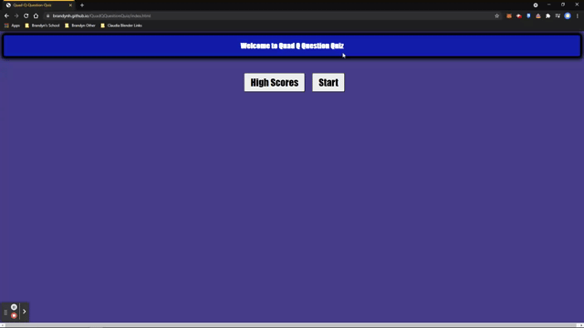

# QuadQQuestionQuiz

## Description
Welcome to the Quad Q Question Quiz 

## Installation
This neat device is built in right [here!](https://brandynh.github.io/QuadQQuestionQuiz/)

## Screenshots

## Credits 
    
By : Brandyn Huffer

### References

* [W3Schools](https://www.w3schools.com/js/js_api_intro.asp)
* [BootCamp Markup Guide](https://coding-boot-camp.github.io/full-stack/github/professional-readme-guide)
* [Mozilla MDN](https://developer.mozilla.org/en-US/docs/Web/API)
* [Stack Overflow](https://stackoverflow.com/questions/29433422/how-to-get-a-list-of-questions-from-stackoverflow-api-based-on-search-query)
* [WebDev Simplified](https://www.youtube.com/channel/UCFbNIlppjAuEX4znoulh0Cw)
